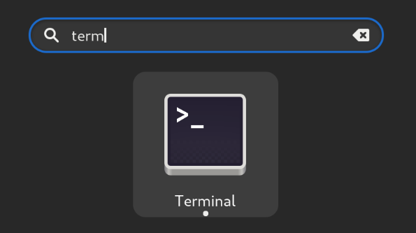
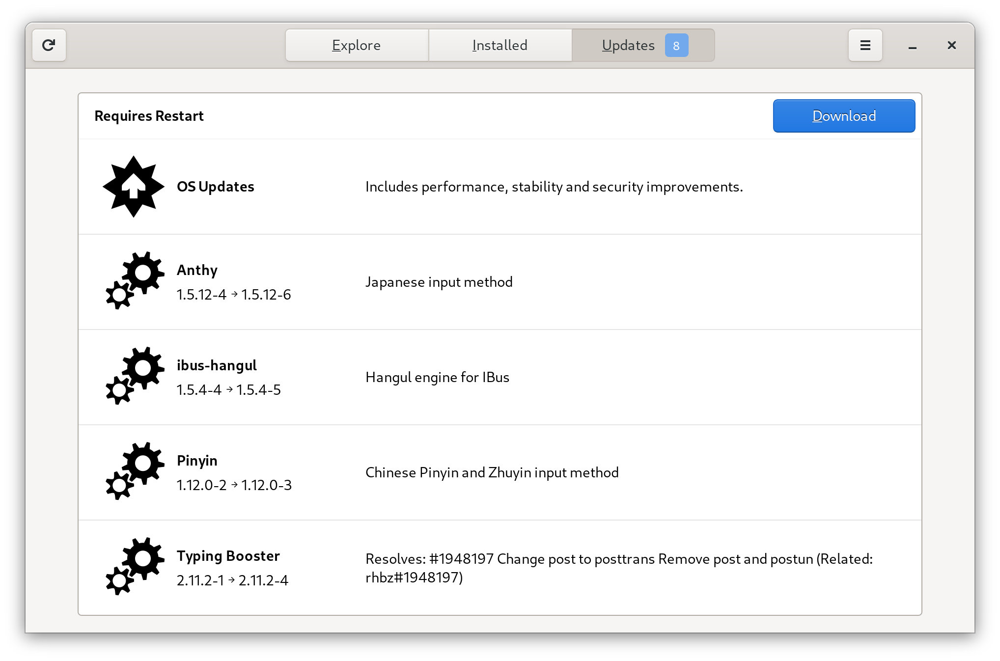
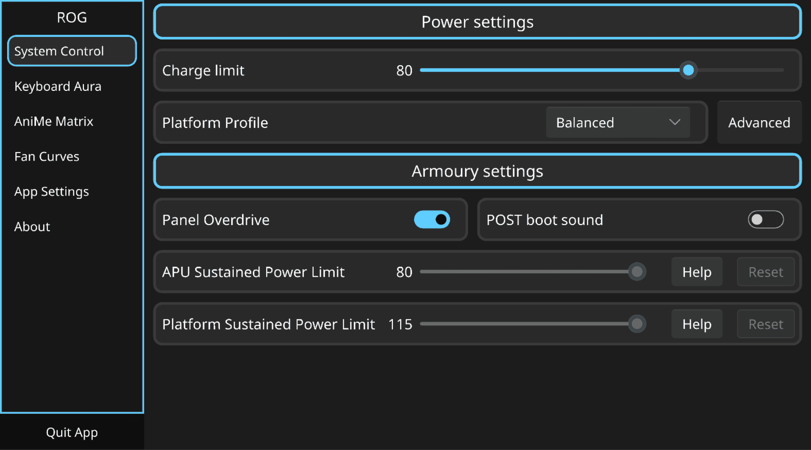

# Fedora Workstation Setup Guide

> A friendly guide for setting up Fedora Workstation on ASUS laptops

Newcomers should start by reading the [Intro](../introduction.md) guide.
For additional information not covered by this guide, consult the official [Fedora Documentation](https://docs.fedoraproject.org/en-US/beginners-guide/).
For simple USB stick flashing: [Fedora Media Writer](https://getfedora.org/en/workstation/download/)

## Contents

- [About Fedora Versions](#about-fedora-versions)
- [Installation](#installation)
- [Setup](#setup)
  - [Using the Terminal](#using-the-terminal)
  - [Update Fedora](#update-fedora)
  - [Enabling the Terra Repository](#enabling-the-terra-repository)
  - [Asusctl](#asusctl)
  - [ROG Control Center](#rog-control-center)
  - [Install Nvidia Graphics Drivers](#install-nvidia-graphics-drivers)
  - [Graphics Switching](#graphics-switching)
- [Optional Steps](#optional-steps)
  - [Installing RPM Fusion](#installing-rpm-fusion)
  - [Hardware Accelerated codecs](#hardware-accelerated-codecs)
  - [Enabling Secure Boot](#enabling-secure-boot)
    - [Install the required tools](#install-the-required-tools)
    - [Initiate the key enrollment](#initiate-the-key-enrollment)
    - [Reboot to enroll the key](#reboot-to-enroll-the-key)
    - [Rebuild the kernel module](#rebuild-the-kernel-module)

### About Fedora Versions

This guide is updated for the current stable release of Fedora.

However, please be aware:

- You need to keep Fedora up to date. If you are 2 versions behind, your OS is no longer supported by Fedora (updates, security, etc.)
- E.g. If Fedora 44 is the current stable release, and you are on Fedora 42, your OS is unsupported.

### Installation

1. Download the latest Fedora Workstation (or KDE Plasma Edition) ISO file from the [official Fedora website](https://getfedora.org/en/workstation/download/) and write it to a USB stick.

> [!NOTE]
> If you want something else than GNOME or KDE as your Desktop Environment, you can check out [Fedora Spins](https://spins.fedoraproject.org/).

2. If you have difficulties starting the live environment from USB, in the Fedora boot menu select: Troubleshooting → Start Fedora in basic graphics mode

3. Follow the steps of the installer, and remove the USB stick when you reboot

4. After rebooting, the installer will present a series of dialog boxes to configure wireless networking, privacy, third party repositories, cloud services, and finally a local user account. Ensure that third party repositories are enabled, so that the proprietary NVIDIA drivers can be installed (covered later in this guide).

### Setup

#### Using the Terminal

This guide requires typing _terminal commands_. To type them, start the Terminal application, which opens a window that has a command prompt.

To open the Terminal, simply press the Windows/Super key to bring up the Start Menu (KDE) or the Activities view (GNOME), and start typing "term" in the search box. Click on the search result.


Commands that have _sudo_ in front are administrator commands, and may require you to type in your password.

#### Update Fedora

The first thing you want to do is definitely make sure your OS is up-to-date, which can address some issues like WiFi not being functional.

> [!TIP]
> If you have trouble getting WiFi or Wired Internet to work (commonly seen on newly released products), use your phone hotspot via USB to get internet access.

Simply run this in the terminal then reboot and you are good to go

```bash
sudo dnf update -y
```

Or if you don't want to use terminal:

1. Open the "Software" application. (KDE Users should use "Discover")
2. Navigate to Updates tab
3. Click the Refresh-button in the top left corner
4. Download all available updates
   
5. After the updates have been downloaded, click the "Restart & Update" button


Wait until the updates are installed.

> [!NOTE]
> It is recommended to restart the system to avoid problems with outdated packages loaded into RAM.

#### Enabling the Terra Repository

ASUS Linux packages and tools are currently packaged on the Terra Repository for Fedora. Add the Terra repo with the following commands:

```bash
sudo dnf install --nogpgcheck --repofrompath 'terra,https://repos.fyralabs.com/terra$releasever' terra-release terra-gpg-keys
```

> [!WARNING]
> The older community-maintained COPR repository is no longer recommended and is currently broken due to expired signing keys, so it should not be used. If you previously enabled it, migrate to the Terra repository by using the above command, and by deleting the old copr repository with `sudo dnf copr remove lukenukem/asus-linux`. Don't forget to reinstall all ASUS Linux tools.

#### Asusctl

This section covers installing asusctl and its supporting software. This enables controls for the Asus ROG hardware on the laptop.

```bash
sudo dnf install asusctl
```

The `asusd` service is started automatically by a udev rule, so it does not need to be enabled. You can check its status or restart it manually:

```bash
systemctl status asusd.service
# or, to restart it:
sudo systemctl restart asusd.service
```

`asusd` manages platform profiles and CPU EPP settings itself. Running an external power management daemon (such as `power-profiles-daemon` or `tuned`) alongside `asusd` can cause race conditions and contention over the platform profile and EPP preferences. You have two options:

1. **Let `asusd` manage profiles** and disable the external daemon. Since Fedora 41, `tuned` is the default power profile daemon. Note that KDE Plasma's PowerDevil can respawn `power-profiles-daemon` through DBus activation even after it is disabled, so be sure to mask it instead:

```bash
sudo systemctl mask --now power-profiles-daemon.service
# or, if you use tuned:
sudo systemctl mask --now tuned.service tuned-ppd.service
```

2. **Keep the external daemon** and disable `asusd`'s profile management by setting the following to `false` in `/etc/asusd/asusd.ron`:

```conf
change_platform_profile_on_ac: false,
change_platform_profile_on_battery: false,
platform_profile_linked_epp: false,
```

See [issue #264](https://github.com/OpenGamingCollective/asusctl/issues/264) for details.

#### ROG Control Center

ROG Control Center is a GUI tool that can be used to configure asusctl. After adding the Terra repository as described above, you can now install the tool:

```bash
sudo dnf install asusctl-rog-gui
```




> [!NOTE]
> For complete functionality and driver support, it is recommended to use a Kernel version of 6.19 or greater.

#### Install Nvidia Graphics Drivers

> [!NOTE]
> AMD dGPU laptop owners can skip this section.

> [!IMPORTANT]
> If you have secure boot enabled at this point, you must disable it to continue. Once you're finished installing drivers, see the section on enabling Secure Boot later to re-enable it.

1. If you didn't enable third-party repositories during the initial install wizard, you can use the following command to enable the RPM Fusion repositories required to install the Nvidia drivers:

```bash
sudo dnf install https://mirrors.rpmfusion.org/free/fedora/rpmfusion-free-release-$(rpm -E %fedora).noarch.rpm https://mirrors.rpmfusion.org/nonfree/fedora/rpmfusion-nonfree-release-$(rpm -E %fedora).noarch.rpm
```

> [!NOTE]
> For Laptops with NVIDIA card older than Turing, install the Negativo17 instead.

2. Install the Nvidia drivers:

```bash
sudo dnf install akmod-nvidia xorg-x11-drv-nvidia-cuda
```

> [!IMPORTANT]
> Please remember to wait after the RPM transaction ends to allow the kmod be built. This can take up to 5 minutes on older systems, and about 2 minutes on newer systems.

3. Reboot your system

For more details, see the official documentation for [RPM Fusion](<https://rpmfusion.org/Howto/NVIDIA?highlight=(%5CbCategoryHowto%5Cb)>).

#### Graphics Switching

See [GPU Switching](../faq/gpu-switching.md) for how to manage the dGPU and MUX.

### Optional Steps

#### Installing RPM Fusion

Usually, when you enable third-party repositories, RPM-Fusion is enabled automatically. However, if it is not, you can follow [this guide](https://rpmfusion.org/Configuration).

```bash
sudo dnf install https://mirrors.rpmfusion.org/free/fedora/rpmfusion-free-release-$(rpm -E %fedora).noarch.rpm https://mirrors.rpmfusion.org/nonfree/fedora/rpmfusion-nonfree-release-$(rpm -E %fedora).noarch.rpm
```

#### Hardware Accelerated codecs

Fedora does not include the codecs needed to use Vaapi on Intel, AMD or Nvidia in its repositories due to potential legal issues. Therefore, you need to install the codecs in your system (Flatpak and containers (like distrobox, toolbx, docker, podman, etc.) must install their own codecs, as they do not share the system ones).

You need [RPM-Fusion](#installing-rpm-fusion) repos and follow [this guide](<https://rpmfusion.org/Howto/Multimedia?highlight=(%5CbCategoryHowto%5Cb)>).

#### Enabling Secure Boot

With Fedora 36 and above, it has become super easy to auto sign kernel modules and enable secure boot. To enable auto signing follow these steps:

##### Install the required tools

```bash
sudo dnf install kmodtool akmods mokutil openssl
```

##### Initiate the key enrollment

> [!NOTE]
> This step requires a password, it doesn't need to be fancy. You'll just need it once during the enrollment.

```bash
sudo kmodgenca -a
sudo mokutil --import /etc/pki/akmods/certs/public_key.der
```

##### Reboot to enroll the key

When you reboot, the MOK Manager will appear, just hit "Enroll MOK" and enter the password set in step 2. After that is completed choose "Continue boot".

##### Rebuild the kernel module

If you installed the nvidia drivers before key enrollment, you must run the following command

```bash
sudo akmods --force --rebuild

sudo dracut --force
```

Then reboot the system:

```bash
sudo systemctl reboot
```

After booting, verify that the rebuilt NVIDIA module is loaded:

```bash
nvidia-smi
```
