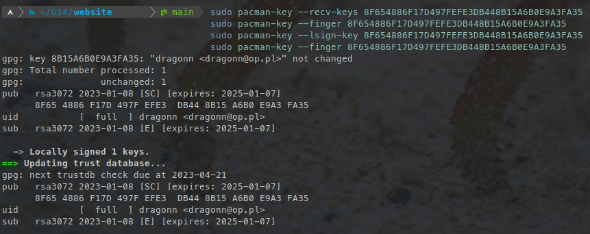

# Arch Linux

> A simple guide for getting Arch running on ASUS laptops

Arch Linux is the preferred distro and the only one that is directly supported by asusctl maintainers.

Since it can be complicated to install arch, in case you don't want even try archinstall, we also suggest trying:

- EndeavourOS as it feels more like a cohesive distro rather than a collection of software to install and configure.
- CachyOS since it has a very easy step-by-step guide, and it has an amazing out-of-the-box experience.
- Garuda is also pretty popular and has gained a fair share of users.

Every linux kernel past and including 6.19 has everything needed to provide a smooth experience, but it is advised to install a kernel from OGC.

If you own a ROG Ally or ROG Ally X ChimeraOS might be a good choice.

## Content

- [Introduction](#introduction)
- [Installation](#installation)
  - [Repository](#repository)
  - [Asusctl](#asusctl)
  - [ROG Control Center](#rog-control-center)
  - [Graphics Switching](#graphics-switching)
  - [Custom kernel - drivers fixes, hardware support](#custom-kernel---drivers-fixes-hardware-support)
  - [OGC kernel](#ogc-kernel)
  - [Nvidia](#nvidia)
    - [Other distributions based on Arch](#other-distributions-based-on-arch)
      - [EndeavourOS](#endeavouros)
  - [Secure Boot](#secure-boot)
    - [Arch](#arch)
      - [Grub bootloader](#grub-bootloader)
      - [Systemd-boot bootloader](#systemd-boot-bootloader)
      - [Limine bootloader](#limine-bootloader)
      - [Verify signed files](#verify-signed-files)
    - [CachyOS](#cachyos)

### Introduction

Read the [Intro](../introduction.md) guide first to avoid bad surprises, especially if you plan to remove windows entirely.

## Installation

To install Arch just follow the regular [installation guide](https://wiki.archlinux.org/title/installation_guide) for the official archlinux or the procedure provided by your distro of choice.

The suggested bootloader is systemd-boot. Avoid using GRUB.

Also remember to install these:

```bash
# AMD systems
pacman -S linux-firmware amd-ucode
# Intel systems
pacman -S linux-firmware intel-ucode
```

choose either amd-ucode or intel-ucode depending on your CPU.

> [!NOTE]
> If you are using the official archlinux read the article about vulkan and install whatever your iGPU might need.

### Repository

> [!NOTE]
> If you are using CachyOS, it doesn't require adding this repo; you can skip this step.

OGC repo contains all the tools you need on a ROG laptop precompiled for you.

Before adding the repo you need to add the repo sign key to your pacman-key. Run the following commands to add it:

```bash
# Ayush key
sudo pacman-key --recv-keys F79100EF8C802DAB81C323BB8EEA5962FE510E19
sudo pacman-key --finger F79100EF8C802DAB81C323BB8EEA5962FE510E19
sudo pacman-key --lsign-key F79100EF8C802DAB81C323BB8EEA5962FE510E19
```

This should show output similar to this:



> [!TIP]
> Have any problems ? Check if `/etc/pacman.d/gnupg/gpg.conf` doesn't have specified the keyserver or make sure it is `hkp://keyserver.ubuntu.com` If you still have problems check if you are not running some active VPN connection, this does sometimes cause problems when fetching the server.

If you still have problems you can do it the less proper way by running those commands

```bash
wget "https://keyserver.ubuntu.com/pks/lookup?op=get&search=0xf79100ef8c802dab81c323bb8eea5962fe510e19" -O ogc.sec
gpg --show-keys ogc.sec
sudo pacman-key -a ogc.sec
```

Verify that the fingerprint shown by `gpg --show-keys` matches the one published on a trusted source before importing, HTTPS alone does not guarantee the key's identity.

After that to get the repo add to your `/etc/pacman.conf` at the end:

```bash
[ogc]
Server = https://pacman.opengamingcollective.org
```

Once done you can then install from there asusctl, rog-control-center and the kernel. After adding the repo run a full system update before you go to install tools from the repo:

```bash
sudo pacman -Syu
```

### Asusctl

> [!IMPORTANT]
> The recommended way to install asusctl is using the OGC pacman repo. Packages like asusctl-git from AUR aren't supported. Also installing manually from cloned git isn't supported

For installing `asusctl` run:

```bash
sudo pacman -S asusctl
```

asusd service is triggered by a udev rule after the keyboard driver is ready, the service doesn't need to be enabled and is not supposed to be.

> [!NOTE]
> Note: Asusctl is designed to work primarily with power-profiles-daemon; other power management tools can create conflicts with asusctl; if you're using an Arch-based distro, you may already have ppd installed, so you might not need to follow this step, as in CachyOS.

```bash
sudo pacman -S power-profiles-daemon
systemctl enable --now power-profiles-daemon.service
```

> [!CAUTION]
> Be aware that some functions or asusctl need kernel-level drivers support, take a look at the "Custom kernel section"

### ROG Control Center

ROG Control Center is a GUI tool for configuring few aspects of asusctl.

```bash
sudo pacman -S rog-control-center
```


### Graphics Switching

It is possible to manage your graphics card using `asusctl` or the ROG Control Center. You can check if your device supports graphics switching by running the following command:

```bash
asusctl armoury list
```

If your device supports disabling of the dGPU, you should see an entry that looks like the following:

```bash
dgpu_disable:
  current: [(0),1]
```

Here, a current value of '0' means that your dgpu is not disabled (i.e., enabled).

You can set whether you want to utilize your dGPU by modifying the setting under the `GPU Configuration` tab in the ROG Control Center. Alternatively, use the command `asusctl armoury set dgpu_disable 1` to disable the dgpu, and 'asusctl armoury set dgpu_disable 0' to re-enable it.

> [!NOTE]
> Due to how Linux systems are configured to use the dGPU, you must reboot your system after changing your dGPU configuration. If you wish to power off your dgpu without rebooting, you should use an alternative program such as Cardwire (see below).

#### Cardwire

Cardwire is the new replacement for the now-deprecated supergfxctl.

> [!CAUTION]
> Cardwire is currently still considered EXPERIMENTAL. If you choose to install this tool, expect rough edges and quirks. For support, join our Discord server.

Cardwire is available on the OGC repository. You can install it with:

```bash
sudo pacman -S cardwire
```

For installation and usage instructions, refer to the [documentation](https://opengamingcollective.github.io/cardwire/).

### Custom kernel - drivers fixes, hardware support

After Linux 6.19, you shouldn't need a custom kernel. However, if you're using an older version or if your device has a feature that hasn't been included in the main kernel release yet, you can use the CachyOS kernel or the OGC kernel.

### OGC kernel

The OGC kernel is the suggested kernel for end-users on arch and is shipped in the organization pacman repo.
It can be installed with this command:

```bash
sudo pacman -Syu linux-ogc linux-ogc-headers
```

> [!CAUTION]
> If you are using a custom kernel use a DKMS package for nvidia drivers: `nvidia-open-dkms` for Turing and newer GPUs or `nvidia-580xx-dkms` (AUR) for Maxwell, Pascal, and Volta. The regular nvidia package works only with stock Arch kernel

After installing the new kernel you need to regenerate your boot menu or add a new boot entry depending on what boot manager you are using.

**Systemd-boot**

```bash
sudo mkinitcpio -P
```

Verify the new kernel entry appears in the boot menu before rebooting:

```bash
sudo bootctl list
```

**Limine**

```bash
sudo limine-update
```

**Grub**

```bash
sudo grub-mkconfig -o /boot/grub/grub.cfg
```

> [!TIP]
> For others refer to their documentation/Arch Wiki page.

You can check currently booted kernel with command uname -r. It should give you for example:

```bash
6.18.1-arch1-g14-1
```

### Nvidia

If your laptop has an NVIDIA GPU, consider using the latest NVIDIA driver.

The driver package depends on your GPU generation:

- Turing and newer (GTX 16 series, RTX 20 series onward): `nvidia-open-dkms`
- Maxwell, Pascal, and Volta: `nvidia-580xx-dkms` (AUR, the proprietary legacy driver is the only supported option for these generations)

> [!NOTE]
> Some Ampere-equipped laptops may crash with the open driver due to GSP firmware issues, in that case use the proprietary driver instead.

Both are DKMS packages and work with custom kernels, while the regular `nvidia` package works only with the stock Arch kernel.

You should also install nvidia-laptop-power-cfg

```bash
git clone https://gitlab.com/asus-linux/nvidia-laptop-power-cfg.git
cd nvidia-laptop-power-cfg
makepkg -sfi
```

If you haven't done already enable nvidia services:

```bash
systemctl enable nvidia-suspend.service nvidia-hibernate.service nvidia-resume.service
systemctl enable --now nvidia-powerd

# Only enable this if you plan to use the feature (unless you know exactly what it does don't touch it)
# systemctl enable nvidia-suspend-then-hibernate.service
```

After a reboot you should see the GPU turning on when needed and off when it's not needed anymore.

Additionally you should query the status of your GPU with

```bash
cat /proc/driver/nvidia/gpus/bus_address/power
```

the bus_address will be different on each model, just use the autocompletion feature of bash spamming tab; the correct result is similar to this:

```
S0ix Power Management:
 Platform Support:          Supported
 Status:                    Enabled
```

If S0ix platform support is supported you want to ensure it is enabled: this is important for sleep and idle power consumption!

Make sure you also install the vulkan adapter for mesa as well:

```bash
# AMD iGPU
sudo pacman -S vulkan-radeon nvidia-utils vulkan-icd-loader
# Intel iGPU
sudo pacman -S vulkan-intel nvidia-utils vulkan-icd-loader
```

### Other distributions based on Arch

#### EndeavourOS

When installing EndeavourOS do not use the option with the Nvidia drivers preinstalled. That driver only works with the stock kernel. Use the default install option then install the DKMS package matching your GPU post-install: `nvidia-open-dkms` for Turing and newer GPUs or `nvidia-580xx-dkms` (AUR) for Maxwell, Pascal, and Volta.

### Secure Boot

#### Arch

On Arch Linux, the easiest way is to use [sbctl](https://wiki.archlinux.org/title/Unified_Extensible_Firmware_Interface/Secure_Boot#Assisted_process_with_sbctl).

> [!NOTE]
> For derivates, you can use the AUR package [sbctl-dracut-conf](https://aur.archlinux.org/packages/sbctl-dracut-conf) or [limine-dracut-support](https://aur.archlinux.org/packages/limine-dracut-support) to quickly configure the system for secure boot.

Install that package, put your laptop in Setup Mode > Advanced Mode (F7) > Security, Secure Boot > Expert Key Management > Reset To Setup Mode on the UEFI menu and boot into archlinux, then issue:

```bash
sudo sbctl create-keys
sudo sbctl enroll-keys --microsoft
```

##### Grub bootloader

You can follow the [wiki](https://wiki.archlinux.org/title/GRUB#Secure_Boot_support) for more information.

##### Systemd-boot bootloader

In systemd-boot, you need to sign several files, which will depend on your specific setup, but the following commands should cover most cases. However, you can check the [wiki](https://wiki.archlinux.org/title/Unified_Extensible_Firmware_Interface/Secure_Boot#Signing) to be sure.

```bash
sudo sbctl verify | sed -E 's|^.* (/.+) is not signed$|sbctl sign -s "\1"|e'
sudo sbctl sign -s -o /usr/lib/systemd/boot/efi/systemd-bootx64.efi.signed /usr/lib/systemd/boot/efi/systemd-bootx64.efi
```

Then it is best to reinstall the kernel and ensure it got signed.

```bash
# use the following command depending on your initramfs generator
# dracut (provided by sbctl-dracut-conf)
sudo dracut-regen
# mkinitcpio
sudo mkinitcpio -P
```

##### Limine bootloader

Limine has its own mechanism for signing the bootloader and kernels; check the [wiki](https://wiki.archlinux.org/title/Limine#Tips_and_tricks) for more details like [dracut](https://aur.archlinux.org/packages/limine-dracut-support) or [mkinitcpio](https://aur.archlinux.org/packages/limine-mkinitcpio-hook), but it should be very simple.

Limine UEFI since 11.2.0 requires to enable automatic config checksum enrollment, set the following line in `/etc/default/limine` (provided by `limine-dracut-support` or `limine-mkinitcpio-hook`):

```bash
ENABLE_ENROLL_LIMINE_CONFIG=yes
```

Then run the following commands to enroll the config and update the bootloader:

```bash
sudo limine-enroll-config
sudo limine-update
```

##### Verify signed files

You have to ensure the bootloader is signed too, otherwise the UEFI won't load it and display you an error message about insecure OS being prevented to be loaded.

To check signed files you have to use

```bash
sudo sbctl verify
```

```bash
sudo sbctl verify
  Verifying file database and EFI images in /boot...
  ✗ /boot/EFI/BOOT/BOOTIA32.EFI is not signed
  ✗ /boot/EFI/BOOT/BOOTX64.EFI is not signed
  ✗ /boot/EFI/Linux/arch-linux.efi is not signed
  ✓ /boot/EFI/Linux/f1710a77781f46bcb9be1b9221102a38_linux.efi is signed
  ✓ /boot/EFI/limine/limine_x64.efi is signed
  ✗ /boot/vmlinuz-linux is not signed
```

In this case, I use limine along with UKI, which signs only a few files, but in principle it should be the bootloader and kernel-related files that should be signed, otherwise the system won't boot.

After the first reboot your laptop will automatically exit setup mode and secure boot will work.

You can check it using this command:

```bash
sbctl status
  Installed:      ✓ sbctl is installed
  Owner GUID:     a9fbbdb7-a05f-48d5-b63a-08c5df45ee70
  Setup Mode:     ✓ Disabled # this should be disabled after the first reboot
  Secure Boot:    ✓ Enabled
  Vendor Keys:    microsoft
```

This is a do-and-forget thing: once the initial setup is done no manual intervention is needed and every new kernel will be automatically signed.

> [!WARNING]
> WARNING This is Arch's official method; derivatives may vary, as in the case of CachyOS, so it is advisable to consult the wiki or forums for the respective Arch derivative.

#### CachyOS

To enable Secure Boot on CachyOS, please follow the [CachyOS Secure Boot Setup guide](https://wiki.cachyos.org/configuration/secure_boot_setup/).
