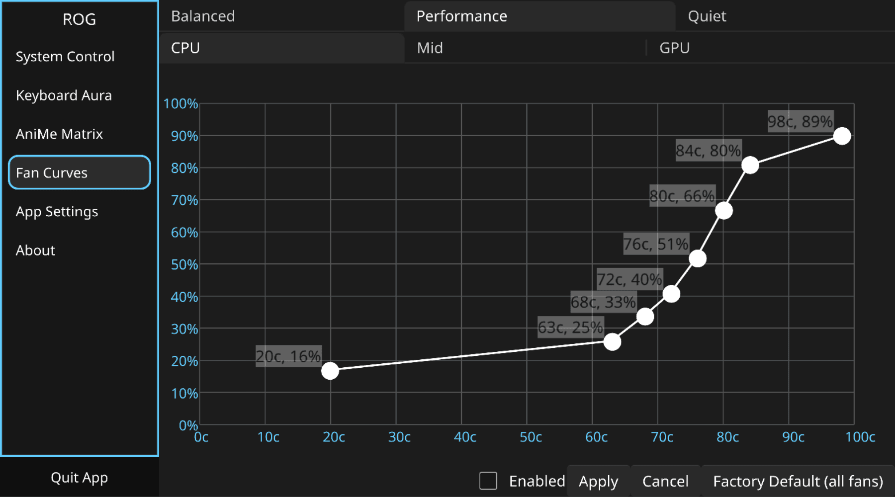

# Fedora Atomic Setup Guide

> A Quickstart Guide to Fedora Atomic Desktops (Silverblue, Kinoite) and Asus-Linux

This guide covers the Fedora Atomic Desktops (Silverblue, Kinoite, Sway Atomic, Budgie Atomic, COSMIC Atomic), which use rpm-ostree for package layering. If you use a Universal Blue image such as Bazzite, see the [Bazzite guide](bazzite.md) instead.

## Contents

- [Installation](#installation)
  - [Enabling the Terra Repository](#enabling-the-terra-repository)
  - [Asusctl](#asusctl)
  - [ROG Control Center](#rog-control-center)
  - [Graphics Switching](#graphics-switching)
  - [After rebooting](#after-rebooting)
- [Optional Steps](#optional-steps)
  - [Installing RPM Fusion](#installing-rpm-fusion)
  - [Hardware Accelerated codecs](#hardware-accelerated-codecs)
  - [Flatpak Cleaning](#flatpak-cleaning)
  - [Replace Firefox RPM with Flathub Flatpak and Force Wayland](#replace-firefox-rpm-with-flathub-flatpak-and-force-wayland)
  - [Nvidia](#nvidia)
  - [Recommended approach](#recommended-approach)
  - [Manual approach](#manual-approach)

### Installation

> [!NOTE]
> Official Fedora packages are maintained by Fyra Labs, the creators of Ultramarine Linux, in Terra repository: they are part of OGC as asus-linux is.

Read the [Intro guide](../introduction.md) first to avoid bad surprises.

#### Enabling the Terra Repository

ASUS Linux packages and tools are currently packaged on the Terra Repository for Fedora. Add the Terra repo with the following commands:

```bash
curl -fsSL https://raw.githubusercontent.com/terrapkg/packages/f$(rpm --eval '%{fedora}')/anda/terra/release/terra.repo | pkexec tee /etc/yum.repos.d/terra.repo
sudo rpm-ostree install terra-release terra-gpg-keys
```

#### Asusctl

This section covers installing asusctl and its supporting software. This enables controls for the Asus ROG hardware on the laptop.

```bash
sudo rpm-ostree install asusctl
```

`asusd` manages platform profiles and CPU EPP settings itself. Running an external power management daemon (such as `power-profiles-daemon` or `tuned`) alongside `asusd` can cause race conditions and contention over the platform profile and EPP preferences. You have two options:

1. **Let `asusd` manage profiles** and disable the external daemon. Since Fedora 41, `tuned` is the default power profile daemon. Note that KDE Plasma's PowerDevil can respawn `power-profiles-daemon` through DBus activation even after it is disabled, so be sure to mask it instead:

```bash
sudo systemctl mask --now power-profiles-daemon.service
# or, if you use tuned:
sudo systemctl mask --now tuned.service tuned-ppd.service
```

2. **Keep the external daemon** and disable `asusd`'s profile management by setting the following to `false` in `/etc/asusd/asusd.ron`:

```conf
change_platform_profile_on_ac: false,
change_platform_profile_on_battery: false,
platform_profile_linked_epp: false,
```

See [issue #264](https://github.com/OpenGamingCollective/asusctl/issues/264) for details.

#### ROG Control Center

ROG Control Center is a GUI tool for configuring few aspects of asusctl. After adding the Terra repository as described above, you can now install the tool:

```bash
sudo rpm-ostree install asusctl-rog-gui
```




now reboot your system to apply the changes

#### Graphics Switching

It is now possible to manage your graphics card using `asusctl` or the ROG Control Center. You can check if your device supports graphics switching by running the following command:

```bash
asusctl armoury list
```

If your device supports disabling of the dGPU, you should see an entry that looks like the following:

```bash
dgpu_disable:
  current: [(0),1]
```

Here, a current value of 0 means that your dgpu is not disabled (i.e., enabled).

You can set whether you want to utilize your dGPU by modifying the setting under the `GPU Configuration` tab in the ROG Control Center. Alternatively, use the command `asusctl armoury set dgpu_disable 1` to disable the dgpu, and 0 to re-enable it.

> [!NOTE]
> Due to how Linux systems are configured to use the dGPU, you must reboot your system after changing your dGPU configuration. If you wish to power off your dgpu without rebooting, you should use an alternative program such as Cardwire (see below).

##### Cardwire

Cardwire is the community's new replacement for the now-deprecated supergfxctl.

> [!CAUTION]
> Cardwire is currently still considered EXPERIMENTAL. If you choose to install this tool, expect rough edges and quirks. For support, join our Discord server.

Cardwire is available on the Terra repository. You can install it with:

```bash
sudo rpm-ostree install cardwire cardwire-gui
```

For installation and usage instructions, refer to the [documentation](https://opengamingcollective.github.io/cardwire/).

#### After rebooting

The `asusd` service is triggered by a udev rule after the keyboard driver is ready, so it does not need to be enabled and is not supposed to be. You can check its status with:

```bash
systemctl status asusd.service
```

> [!NOTE]
> ASUS releases new products every year, so it is not possible to guarantee that everything will work on the current Fedora vanilla kernel. For this reason, depending on your device, you may require a kernel that has the latest patches such as ASUS Armoury (this driver is available in Linux 6.19 and later versions) or similar, for example, CachyOS Kernel (at least until the OGC kernel is ready). However, depending on your case and your needs, this may be optional. Read Custom Kernel.

### Optional Steps

#### Installing RPM Fusion

Usually, when you enable third-party repositories, RPM-Fusion is enabled automatically. However, if it is not, you can follow this [guide](https://rpmfusion.org/Configuration).

```bash
sudo dnf install https://mirrors.rpmfusion.org/free/fedora/rpmfusion-free-release-$(rpm -E %fedora).noarch.rpm https://mirrors.rpmfusion.org/nonfree/fedora/rpmfusion-nonfree-release-$(rpm -E %fedora).noarch.rpm
```

#### Hardware Accelerated codecs

The Atomic versions of Fedora do not include codecs in the system image, because these distros are focused on modifying as little as possible to ensure stability. It is recommended to use Flatpak, Distrobox, Toolbox, or any other type of container, as these do not share codecs with the system and prevent you from having to install them. However, if you want to install them, you can follow this guide but remember install RPM-Fusion repos first.

> [!TIP]
> Universal Blue and its images already include the codecs in the system, so it is not necessary to perform these procedures.

#### Flatpak Cleaning

In order to streamline our dependency on flatpak it is worthwhile to have everything working with the same fundamentals.

```bash
flatpak remote-delete fedora
flatpak remote-add --if-not-exists flathub https://flathub.org/repo/flathub.flatpakrepo
```

The steps above will uninstall the packages from the Fedora remote, so the following command will install the Flathub versions instead (Apply only on Silverblue version).

```bash
flatpak install org.gnome.Calculator org.gnome.Calendar org.gnome.Characters org.gnome.Connections org.gnome.Contacts org.gnome.Papers org.gnome.Logs org.gnome.Loupe org.gnome.Maps org.gnome.NautilusPreviewer org.gnome.Snapshot org.gnome.Weather org.gnome.baobab org.gnome.clocks org.gnome.font-viewer org.gnome.Showtime org.gnome.TextEditor org.gnome.Decibels
```

##### Replace Firefox RPM with Flathub Flatpak and Force Wayland

```bash
sudo rpm-ostree override remove firefox firefox-langpacks
flatpak install flathub org.mozilla.firefox org.freedesktop.Platform.ffmpeg-full
```

#### Nvidia

Nvidia in Atomic versions requires key enrollment. However, you may need to repeat this process after an update, although you can use [this](https://github.com/CheariX/silverblue-akmods-keys), so below you will find two options.

##### Recommended approach

The recommended approach is to use or rebase [Bazzite](https://bazzite.gg/), [Bluefin](https://projectbluefin.io/), [Aurora](https://getaurora.dev/en), or a vanilla image of [Universal Blue](https://github.com/orgs/ublue-os/packages?tab=packages&q=silverblue-nvidia) with the Nvidia driver already configured. If you rebase to Bazzite, see the [Bazzite guide](bazzite.md) for installing asusctl.

If you want rebase follow this [guide](https://docs.getaurora.dev/guides/alternate-install-guide).

##### Manual approach

If you are unable or unwilling to use the method described above, you can follow these steps:

Add RPM-Fusion repos:

```bash
sudo rpm-ostree install --apply-live https://mirrors.rpmfusion.org/free/fedora/rpmfusion-free-release-$(rpm -E %fedora).noarch.rpm https://mirrors.rpmfusion.org/nonfree/fedora/rpmfusion-nonfree-release-$(rpm -E %fedora).noarch.rpm
```

> [!NOTE]
> If your laptop has an NVIDIA card older than Turing, the repo to install is [Negativo17](https://negativo17.org/nvidia-driver-580-lts-repository/).

Install Nvidia drivers:

```bash
sudo rpm-ostree install akmod-nvidia xorg-x11-drv-nvidia xorg-x11-drv-nvidia-cuda
sudo rpm-ostree kargs --append=rd.driver.blacklist=nouveau,nova_core --append=modprobe.blacklist=nouveau,nova_core
```

Wait for the module to be built, then reboot:

```bash
sudo systemctl reboot
```

After booting, verify that the NVIDIA driver is loaded:

```bash
nvidia-smi
```
