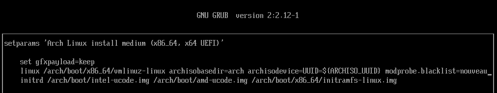

# Introduction

> A friendly guide for setting up Linux on ASUS laptops

So you have decided to try out Linux in your ASUS laptop... That's great! However there are a few things to do before you can enjoy your linux installation.

> [!NOTE]
> This guide does not cover the choices of running Windows and Linux, or only Linux on your device, and their respective partitioning requirements.

## Content

- [Backup Proprietary eSupport Drivers Folder](#backup-proprietary-esupport-drivers-folder)
- [Creating a win-to-go installation](#creating-a-win-to-go-installation)
- [Disable VMD](#disable-vmd)
- [Disable fastboot](#disable-fastboot)
- [Disable Secure Boot](#disable-secure-boot)
- [Use the Laptop Screen](#use-the-laptop-screen)
- [Disable nouveau](#disable-nouveau)
- [Switch to Hybrid mode on Windows](#switch-to-hybrid-mode-on-windows)

### Backup Proprietary eSupport Drivers Folder

Stock installations of Windows on ASUS laptops include proprietary drivers that cannot be sourced directly from the ASUS website or the MyASUS utility. Before removing the Windows partition or recovery partition these drivers should be backed up. If you ever decide to dual boot or run Windows in a VM, you will need a copy of the drivers for your specific model.

When present, the folder can be found in `C:\eSupport`. Make sure to back up this folder, before performing any destructive operations on your Windows partition !

### Creating a win-to-go installation

Certain laptops have one or more firmware for internal devices that must be updated using windows: it is very important you keep windows in a bootable state on a (preferably fast SSD or nvme) external disk!

Use your Windows installation to run [Rufus](https://rufus.ie/) and create a Win-to-Go installation of Windows.

Once done start that windows installation and ensure it says it has a valid license (license should be applied from the ACPI just by booting up the installation) and install the official ASUS Armoury Crate as well as any other driver that is available via the ASUS website for your model.

> [!WARNING]
> You are supposed to use this windows installation to fully update your laptop before installing linux and regularly after!

> [!WARNING]
> The windows installation might be required if you ask for help to troubleshoot certain issues, so be sure to keep it safe and update it as well as armoury crate from time to time!

### Disable VMD

Intel laptops have a feature called VMD that is not supported by linux and should be disabled (on the UEFI setup screen) to avoid problems.

AMD laptops can have a RAID mode that should also be disabled: use a software RAID instead if you need such feature.

### Disable fastboot

The fastboot feature is known to cause random issues for Linux, especially with Wi-Fi cards. It is strongly recommended to disable it in the UEFI setup screen.

### Disable Secure Boot

In Linux, whether or not you need to disable Secure Boot depends heavily on the distro. Installing Arch and its derivatives requires temporarily disabling it, while distros like Fedora typically don't require disabling Secure Boot at any point. That said, it's possible to enable it after installation using tools that simplify the process, such as sbctl. For this reason, leaving Secure Boot disabled post-install is not recommended unless you're running into issues with NVIDIA drivers or custom kernels. This is actually one of the reasons why Arch and Arch-based distros are worth considering — sbctl makes signing the kernel and bootloader straightforward.

> [!IMPORTANT]
> IMPORTANT FOR DUAL BOOT USERS!!! DISABLE WINDOWS BITLOCKER BEFORE DOING THIS! OR YOUR DATA WILL BE GONE FOREVER!

To verify Nvidia drivers and the necessary support modules work without issues, [Secure Boot](https://www.youtube.com/watch?v=S12HIHTrccg) can be disabled in the UEFI.

Guide to disable Secure Boot on bios.

1. Press DEL repeatedly during boot to enter UEFI setup screen
2. Press F7 for advanced mode
3. Security → Secure Boot Control → Disable
4. Save and exit

This move won't brick your laptop, the only risk here is your data in Windows if you didn't disable Bitlocker before doing this.

### Use the Laptop Screen

Due to display signal routing on Asus ROG laptops, and the setup process dealing with multiple graphics devices, having external screens connected during setup may result in unpredictable behavior. Please install your OS with all external displays disconnected.

### Disable nouveau

You might encounter the issue about nouveau crashing the installation: this can be solved by adding the boot parameters `rd.driver.blacklist=nouveau,nova_core modprobe.blacklist=nouveau,nova_core` to the kernel cmdline before booting the installation media. To edit the installation media boot entry just press e on it and then put the blacklist parameters at the end of all parameters. Example:

The same parameter can be used to boot the installed system, but it is not needed after installing official nvidia drivers.

### Switch to Hybrid mode on Windows

If you have a 2022 or newer model, please put it into Hybrid mode in advance on Windows. Otherwise, it may cause some unexpected bugs/issues.
